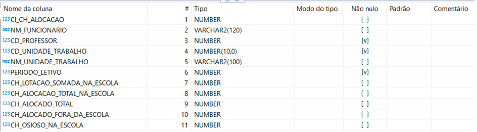

# Banco de Dados: Homologação

A tabela abaixo contém as informações para identificação e acesso ao banco de dados de Homologação.

| Esquema | Horários     |
|---------|--------------|
| IP      | 172.23.7.175 |
| Porta   | 1521         |
| Usuário | HORARIOS     |
| Senha   | FScxh77UomDRmkqb$oTh |
| Service | SMEHMG |


## **Diagramas dos esquemas**
### Tabelas que possuem estrutura relacional

Este banco de dados não possui tabelas com estruturas relacionais. 

### Tabelas que não possuem estruturas relacionais

Abaixo estarão listadas todas as tabelas que não possuem estruturas relacionais. As informações descritas sobre cada
tabela será o seu nome, uma descrição sobre os dados, as colunas existentes com informações do tipo de dados e se pode
ser dado nulo ou não, qual a *primary-key* e, por fim, a DDL desta tabela.

**Nome da tabela** 

#### VW_CH_ALOCACAO_PROFESSOR 

**Sobre os dados**

Informações sobre a alocação do professor em uma escola, os dados trazem informações sobre o professor,
a carga horária alocada na escola e qual escola está alocado. 

**Colunas**




**Primary-key (PK)**

Não possui.


**DDL**

```{.sql}
-- HORARIOS.VW_CH_ALOCACAO_PROFESSOR source 

CREATE OR REPLACE FORCE VIEW "HORARIOS"."VW_CH_ALOCACAO_PROFESSOR" ("CI_CH_ALOCACAO", "NM_FUNCIONARIO", "CD_PROFESSOR", "CD_UNIDADE_TRABALHO", "NM_UNIDADE_TRABALHO", "PERIODO_LETIVO", "CH_LOTACAO_SOMADA_NA_ESCOLA", "CH_ALOCACAO_TOTAL_NA_ESCOLA", "CH_ALOCADO_TOTAL", "CH_ALOCADO_FORA_DA_ESCOLA", "CH_OSIOSO_NA_ESCOLA") AS  

SELECT rownum AS "CI_CH_ALOCACAO", 

CH_ALOCACAO.NM_FUNCIONARIO AS "NM_FUNCIONARIO", 

CH_ALOCACAO.CD_PROFESSOR AS "CD_PROFESSOR", 

CH_ALOCACAO.CD_UNIDADE_TRABALHO AS "CD_UNIDADE_TRABALHO", 

CH_ALOCACAO.NM_UNIDADE_TRABALHO AS "NM_UNIDADE_TRABALHO", 

CH_ALOCACAO.PERIODO_LETIVO AS "PERIODO_LETIVO", 

CH_ALOCACAO.CH_LOTACAO_SOMADA_NA_ESCOLA AS "CH_LOTACAO_SOMADA_NA_ESCOLA", 

CH_ALOCACAO.CH_ALOCACAO_TOTAL_NA_ESCOLA AS "CH_ALOCACAO_TOTAL_NA_ESCOLA", 

CH_ALOCACAO.CH_ALOCADO_TOTAL AS "CH_ALOCADO_TOTAL", 

CH_ALOCACAO.CH_ALOCADO_TOTAL - CH_ALOCACAO.CH_ALOCACAO_TOTAL_NA_ESCOLA AS "CH_ALOCADO_FORA_DA_ESCOLA", 

CH_ALOCACAO.CH_LOTACAO_SOMADA_NA_ESCOLA - CH_ALOCACAO.CH_ALOCACAO_TOTAL_NA_ESCOLA AS "CH_OSIOSO_NA_ESCOLA" 

FROM ( 

SELECT DISTINCT tac.CD_VINCULO AS "ADITIVO_VINCULO", 

tf.NM_FUNCIONARIO AS "NM_FUNCIONARIO", 

tv.CD_FUNCIONARIO AS "CD_PROFESSOR", 

lp.CD_UNIDADE_TRABALHO AS "CD_UNIDADE_TRABALHO", 

tut.NM_UNIDADE_TRABALHO AS "NM_UNIDADE_TRABALHO", 

tpl.NR_PERIODO_LETIVO AS "PERIODO_LETIVO", 

(SELECT sum(lp2.NR_CARGA_HORARIA) 

FROM rh.TB_LOTACAO_PROFESSOR lp2 

LEFT JOIN rh.TB_VINCULO tv2 ON tv2.CI_VINCULO = lp2.CD_VINCULO 

LEFT JOIN rh.TB_FUNCIONARIO tf2 ON tf2.CI_FUNCIONARIO = tv2.CD_FUNCIONARIO 

WHERE tv2.NR_MATRICULA = tv.NR_MATRICULA 

AND lp2.CD_PERIODO_LETIVO = lp.CD_PERIODO_LETIVO 

AND lp2.FL_ATIVO = 1 

AND TO_DATE(TO_CHAR(lp2.DT_FIM, 'yyyy-MM-dd'), 'yyyy-MM-dd') >= 

TO_DATE(TO_CHAR(SYSDATE, 'yyyy-MM-dd'), 'yyyy-MM-dd')) AS "CH_LOTACAO_SOMADA_NA_ESCOLA", 

(SELECT count(tbh.CI_HORARIO)  

FROM HORARIOS.TB_HORARIO tbh 

WHERE tgh.CI_GRADE_HORARIA = tbh.CD_HORARIO 

AND tv.CD_FUNCIONARIO = tbh.CD_PROFESSOR 

AND tbh.FL_ATIVO = 1 

) AS "CH_ALOCACAO_TOTAL_NA_ESCOLA", 

(SELECT COUNT(th.CI_HORARIO) 

FROM HORARIOS.TB_GRADE_HORARIA tgh2 

LEFT JOIN HORARIOS.TB_HORARIO th ON th.CD_HORARIO = tgh2.CI_GRADE_HORARIA 

WHERE tv.CD_FUNCIONARIO = th.CD_PROFESSOR 

AND th.FL_ATIVO = 1 

AND tgh2.FL_ATIVO=1 

AND tgh2.TP_STATUS=1 

AND tgh2.CD_PERIODO_LETIVO = tpl.NR_PERIODO_LETIVO 

) AS "CH_ALOCADO_TOTAL" 

 

FROM RH.TB_LOTACAO_PROFESSOR lp 

 	JOIN RH.TB_VINCULO tv ON tv.CI_VINCULO = lp.CD_VINCULO 

JOIN RH.TB_FUNCIONARIO tf ON tf.CI_FUNCIONARIO = tv.CD_FUNCIONARIO 

JOIN EDUCACAO.TB_PERIODO_LETIVO tpl ON tpl.CI_PERIODO_LETIVO = lp.CD_PERIODO_LETIVO 

JOIN UTIL.TB_UNIDADE_TRABALHO tut ON tut.CI_UNIDADE_TRABALHO = lp.CD_UNIDADE_TRABALHO 

 LEFT JOIN rh.TB_ADITIVO_CH tac ON tac.CD_VINCULO = tv.CI_VINCULO 

 LEFT JOIN HORARIOS.TB_GRADE_HORARIA tgh ON lp.CD_UNIDADE_TRABALHO = tgh.CD_UNIDADE_TRABALHO 

WHERE tv.DT_VACANCIA IS NULL 

 AND tv.DT_APOSENTADORIA IS NULL 

 AND tv.CD_TIPO_VINCULO NOT IN (1, 15, 61)  

 AND lp.FL_ATIVO = 1 

 AND TO_DATE(TO_CHAR(lp.DT_FIM, 'yyyy-MM-dd'), 'yyyy-MM-dd') >= TO_DATE(TO_CHAR(SYSDATE, 'yyyy-MM-dd'), 'yyyy-MM-dd') 

 AND tgh.FL_ATIVO=1 

 AND tgh.TP_STATUS=1 

 AND tgh.CD_PERIODO_LETIVO = tpl.NR_PERIODO_LETIVO 

GROUP BY	tac.CD_VINCULO, 

tf.NM_FUNCIONARIO, 

tv.CD_FUNCIONARIO, 

tv.NR_MATRICULA, 

lp.CD_UNIDADE_TRABALHO, 

lp.CD_PERIODO_LETIVO, 

 	tut.NM_UNIDADE_TRABALHO, 

 	tpl.NR_PERIODO_LETIVO, 

 	tgh.CI_GRADE_HORARIA, 

 	tgh.FL_ATIVO, 

 	tgh.TP_STATUS 

) CH_ALOCACAO; 
```
